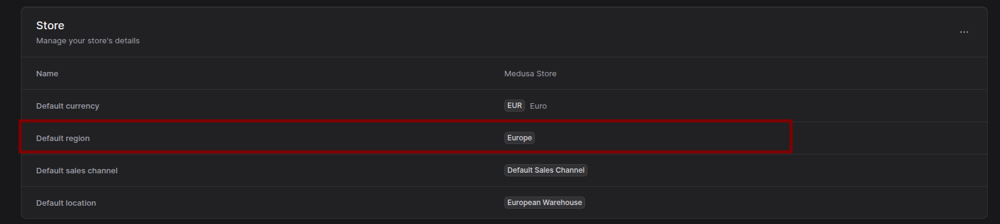

# Steps to reproduce the bug

This project run with the docker compose. The original steps can be found [here](https://docs.medusajs.com/learn/installation/docker). 

1. Run `docker compose up -d`
2. Set the admin credentials
    ```
    docker compose run --rm medusa npx medusa user -e admin@example.com -p supersecret
    ```
3. By default, the seed data will be implemented. So you will have a single region. Set the region accordingly in the admin panel
    
4. Fetch the products, including the variants calculated price.
    ```bash
    curl --location 'http://localhost:9000/store/products?fields=*variants.calculated_price%2C+variants.inventory_quantity' \
    --header 'x-publishable-api-key: [put your api key here]
    ```


## Expected
1. Since there is only a single default region, expected that the product list with the variant's calculated price is successful.


## Actual
1. Fetching the above with the variant's price will return error
    ```json
    {
        "type": "invalid_data",
        "message": "Missing required pricing context to calculate prices - region_id"
    }
    ```